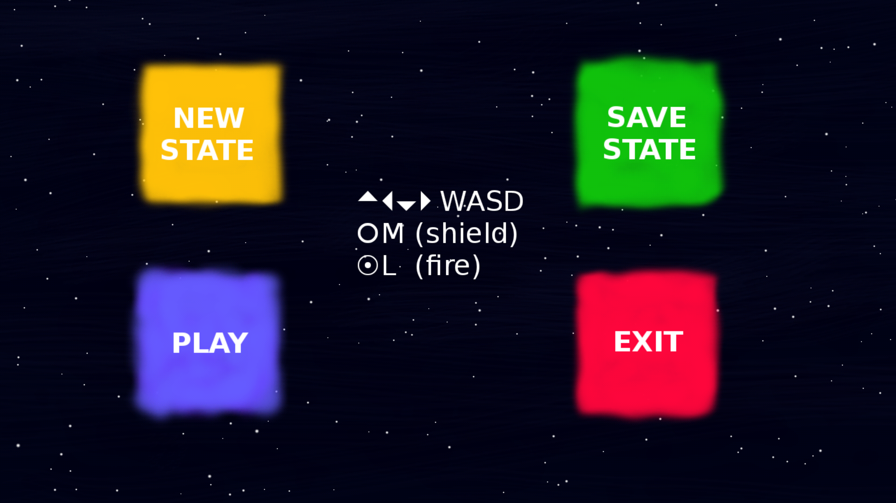
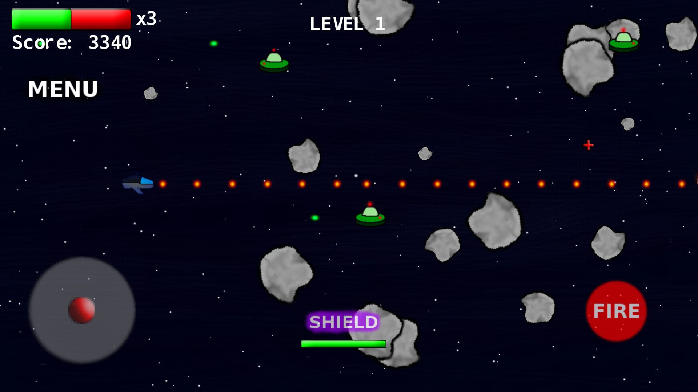
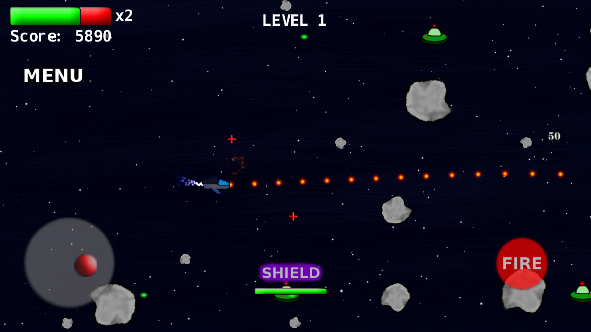
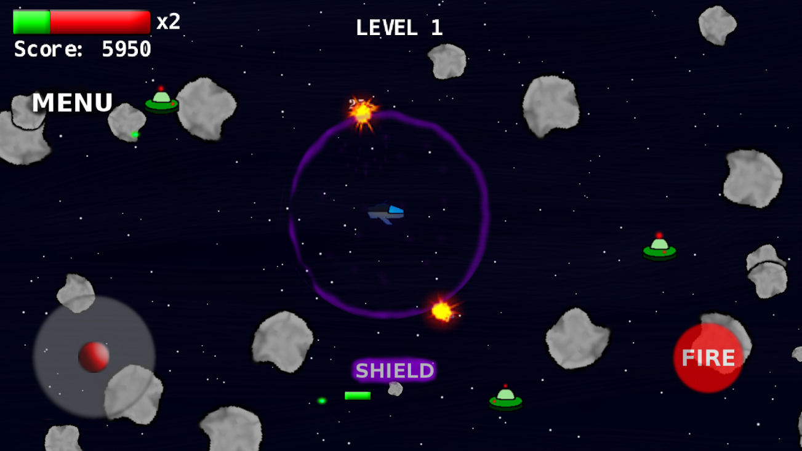

# Geek University Android 
## 1 семестр
## Разработка игр под Android
13 сентября 2017 MSK (UTC+3)

В финальный проект добавлено:
1. сохрание состояния игрока
2. комментарии 
3. кнопка "SHIELD" и полосу зарядки щита
4. добавил powerUp "SHIELD"
5. подключил JavaDocs https://gdavidlevy.github.io/DevelopingGamesForAndroid/

